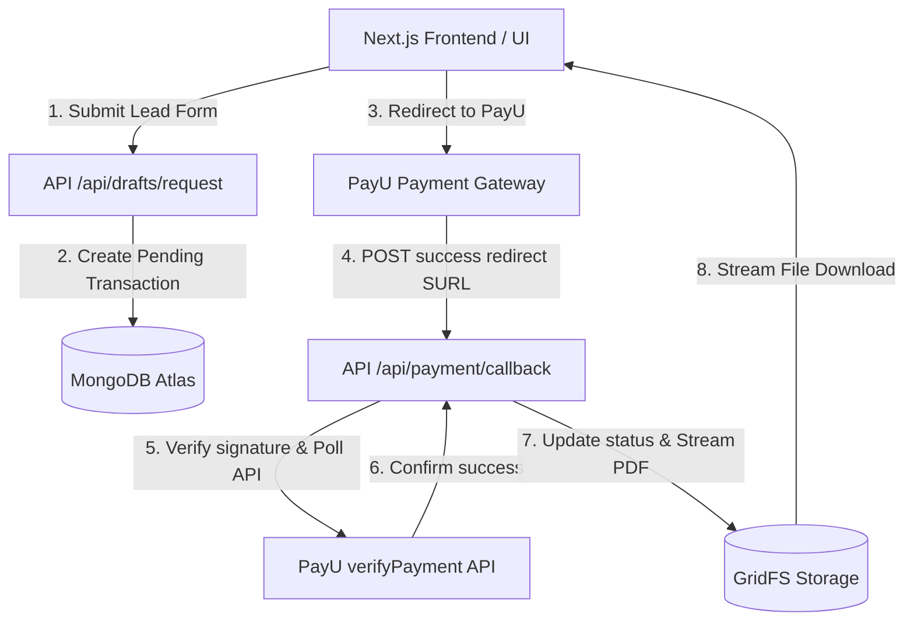

# AMA Connect: Custom MongoDB & PayU Backend Architecture Blueprint

This document details the refined, customized backend architecture for the **AMA Connect** portal, fully aligned with your technology choices, lead-generation strategy, and monetized drafts catalog.

---

## 🏛️ System Architecture Overview

The platform uses a **Next.js Serverless + MongoDB Atlas** architecture, fully optimized for fast loads, media storage, and webhook-less transaction security.



### Key Technology Stack:
1.  **Core Database**: **MongoDB Atlas (NoSQL)** using the **Mongoose ORM** client for rapid JSON schema development and nested sub-document queries.
2.  **Authentication**: **NextAuth.js (Auth.js)** with the official **MongoDB Adapter**. 100% free, self-hosted, with infinite production sign-ups and zero platform charges.
3.  **Media & Document Storage**: **MongoDB GridFS** to host ~1,000 legal PDF templates and guest post featured images inside your database, keeping your git repository light and assets unified.
4.  **Transaction Gatekeeping**: **PayU Payment Gateway (India)** to charge ₹499 per template download.
5.  **Search Optimization**: **MongoDB Atlas Search** (Lucene-backed fuzzy search) providing typo-tolerant, instant search results across all 1,000 templates.

---

## 🔑 Collection Schemas & Data Model

We use a **Highly Denormalized / Embedded Sub-document Model** for maximum read performance. This allows fetching complete data cards in a single database query.

### 1. `users` & `accounts` (Managed by NextAuth MongoDB Adapter)
Stores authenticated user sessions, roles (`USER`, `LAWYER`, `ADMIN`), and purchase history.

### 2. `questions` (Legal Q&A Read-Only Feed)
Synchronized dynamically via server-to-server API pull from your main AMA Connect application database. To ask questions, guests are prompted with a popup to download the mobile app.
*   **Embedded relationships (No Upvotes or Comments)**:
    ```json
    {
      "_id": "q_101",
      "question": "I have missed several EMIs on my personal loan...",
      "author": "Rohan Mehta",
      "avatar": "/man.png",
      "tags": ["Loan Settlement", "EMI Default"],
      "answers": [
        {
          "_id": "ans_201",
          "verifiedBy": "AMA Legal Team",
          "logo": "/logo_qa.png",
          "rating": 4.5,
          "text": "You can contact your lender...",
          "createdAt": "2026-05-18T12:00:00Z"
        }
      ]
    }
    ```

### 3. `stories` (Lawyer Guest Articles)
Manually curated by the Admin (no public creation forms to eliminate spam).
*   **Fields**: Title, author, designation, court, tags, content (text/Markdown), and a single featured image hosted in **MongoDB GridFS**.

### 4. `success_stories` (Client Success Testimonials)
**Auto-Published (Public by Default)** upon submission via the frontend form, secured with a lightweight, server-side profanity sanitizer.
*   **Fields**: ClientName, clientProfession, issueDescription (text body), status ("APPROVED" by default), createdAt.

### 5. `drafts` & `fs.files` (GridFS Draft Templates)
Contains ~1,000 legal notice templates hosted directly inside MongoDB GridFS.
*   **Fields**: Title, category, subCategory, gridFsFileId (reference to binary file), downloads count.

### 6. `transactions` & `leads` (Monetization & Sales Funnel)
Gates PDF downloads behind ₹499 PayU transactions and standard contact forms.
*   **Fields**: LeadName, leadEmail, leadPhone, draftId, amount (499.00), payuTxnId, status ("PENDING", "SUCCESS", "FAILED"), createdAt.

### 7. Communities (WhatsApp Group Redirect)
*   **Zero Database footprint**: No collection required. The frontend "Join Community" button redirects visitors directly to your **Official WhatsApp Group Invitation Link** (e.g. `https://chat.whatsapp.com/invite_code`) where the active user community lives.

---

## ⚡ PayU Webhook-Less Transaction Workflow

To eliminate payment drops from failing webhooks, we enforce client-side redirection verification combined with backend-polling:

```text
[User Checkout] 
       ↓
[Next.js API: Create Pending Transaction in MongoDB]
       ↓
[Redirect User to PayU Gateway]
       ↓
[User Pays ₹499 successfully]
       ↓
[PayU Redirects user's browser back to Next.js API: /api/payment/callback]
       ↓
[Next.js Backend: Verify PayU Hash Signature & Query PayU verifyPayment API]
       ↓
[Next.js Backend: Update status to SUCCESS in MongoDB & stream PDF from GridFS]
       ↓
[User Browser: Downloads file automatically while showing Success Landing Page]
```

This workflow is **100% fail-safe** because it handles payment capture and file delivery right inside the user's active browser window, checking status directly against PayU APIs.
